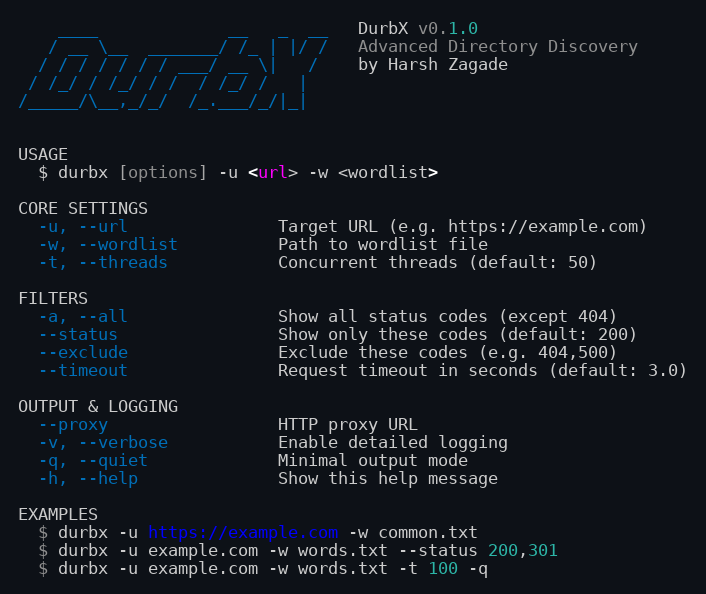
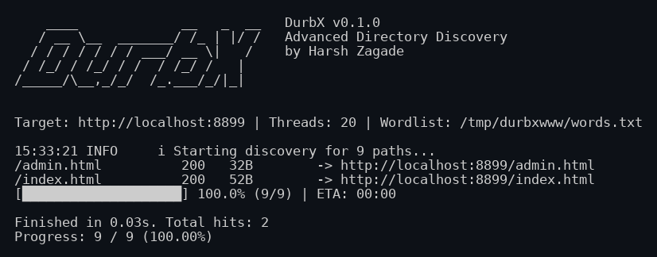

# DurbX

<p align="center">
  
  
  
</p>

**DurbX** is an asynchronous directory and file discovery tool for web targets. Give it a URL and a wordlist, and it concurrently requests each path, reporting the ones that respond — with status code, response size, and redirect target — while filtering out the noise (404s by default). It is built on `aiohttp` for high-concurrency scanning with a bounded worker pool, DNS caching, and a live progress bar.

---

## 📸 Screenshots

Real terminal captures from an actual run (local test server — no real target was scanned):

**Help screen**



**Live scan**



---

## ✨ Features

- **Async engine** — built on `aiohttp` + `asyncio`; one worker per thread-slot with a bounded `TCPConnector` pool, so concurrency never exhausts resources
- **Smart filtering** — shows only `200 OK` by default; `--all` shows everything except 404; `--status` allowlist and `--exclude` denylist for precise control
- **Fast feedback** — real-time progress bar with ETA, color-coded results, per-request timeout (default 3s)
- **Wordlist handling** — strips whitespace and leading slashes, drops duplicates, skips `#` comments and blank lines
- **URL normalization** — `example.com` becomes `https://example.com` automatically
- **Proxy support** — route traffic through an HTTP proxy (e.g. Burp Suite) with `--proxy`
- **Output modes** — verbose logging (`-v`) for debugging, quiet mode (`-q`) that suppresses the banner and summary lines for cleaner piped output
- **Graceful errors** — connection errors and timeouts are caught per-request; `Ctrl+C` exits cleanly
- **Rate-limit handling** — backs off and retries HTTP 429 responses (exponential backoff, honors the server's `Retry-After` header); tune with `--retries`

---

## 📦 Installation

### Using pipx (recommended)

```bash
git clone https://github.com/harshzagade/DurbX.git
cd DurbX
pipx install .
```

### Using pip

```bash
pip install .
```

Requires Python 3.10+ and the dependencies in `requirements.txt` (`aiohttp`, `colorama`, `rich`).

---

## 🚀 Quick Start

```bash
# Basic scan: show only 200 OK responses
durbx -u https://example.com -w wordlist.txt

# High-concurrency scan
durbx -u https://example.com -w wordlist.txt -t 100

# Show everything except 404
durbx -u https://example.com -w wordlist.txt -a

# Show only specific status codes
durbx -u https://example.com -w wordlist.txt --status 200,301,403

# Exclude noisy codes
durbx -u https://example.com -w wordlist.txt --exclude 404,500,503
```

> ⚠️ Only scan targets you own or are authorized to test. See the [Disclaimer](#-disclaimer).

---

## 📖 Usage Examples

All flags below are verified against `durbx --help`.

```bash
# Scan through a proxy (e.g. Burp Suite)
durbx -u https://example.com -w wordlist.txt --proxy http://127.0.0.1:8080

# Custom per-request timeout (seconds)
durbx -u https://example.com -w wordlist.txt --timeout 5

# Control 429 retry behavior (default: 3 retries with backoff; 0 disables)
durbx -u https://example.com -w wordlist.txt --retries 5

# Quiet mode: banner and summary suppressed, results stream cleanly
durbx -u https://example.com -w wordlist.txt -q

# Verbose logging
durbx -u https://example.com -w wordlist.txt -v

# Scheme is optional; -t sets concurrency (default: 50)
durbx -u example.com -w words.txt -t 20
```

### Integration

```bash
# Pipe hits into httpx
durbx -u example.com -w wordlist.txt -q | httpx -silent

# Save results
durbx -u example.com -w wordlist.txt -q > found.txt
```

---

## 📊 Sample Output

Actual output from a scan against a local test server (`python3 -m http.server`):

```
    ____             __   _  __   DurbX v0.1.0
   / __ \__  _______/ /_ | |/ /   Advanced Directory Discovery
  / / / / / / / ___/ __ \|   /    by Harsh Zagade
 / /_/ / /_/ / /  / /_/ /   |
/_____/\__,_/_/  /_.___/_/|_|

Target: http://localhost:8899 | Threads: 20 | Wordlist: words.txt

15:33:21 INFO     i Starting discovery for 9 paths...

/admin.html          200   32B        -> http://localhost:8899/admin.html
/index.html          200   52B        -> http://localhost:8899/index.html
[████████████████████] 100.0% (9/9) | ETA: 00:00

Finished in 0.03s. Total hits: 2
Progress: 9 / 9 (100.00%)
```

Status colors: `200` green, `301`/`302` magenta, `403` yellow, `500+`/errors red, `404` hidden by default.

---

## 🔧 CLI Options

```
USAGE
  $ durbx [options] -u <url> -w <wordlist>

CORE SETTINGS
  -u, --url               Target URL (e.g. https://example.com)
  -w, --wordlist          Path to wordlist file
  -t, --threads           Concurrent threads (default: 50)

FILTERS
  -a, --all               Show all status codes (except 404)
  --status                Show only these codes (default: 200)
  --exclude               Exclude these codes (e.g. 404,500)
  --timeout               Request timeout in seconds (default: 3.0)
  --retries               Retry 429s with backoff (default: 3; 0 disables)

OUTPUT & LOGGING
  --proxy                 HTTP proxy URL
  -v, --verbose           Enable detailed logging
  -q, --quiet             Minimal output mode
  -h, --help              Show this help message

EXAMPLES
  $ durbx -u https://example.com -w common.txt
  $ durbx -u example.com -w words.txt --status 200,301
  $ durbx -u example.com -w words.txt -t 100 -q
```

---

## 🎯 How It Works

1. **URL normalization** — `example.com` → `https://example.com`
2. **Wordlist loading** — strip whitespace/leading slashes, drop duplicates, skip `#` comments
3. **Concurrent scan** — a bounded `aiohttp` worker pool (size = `-t`, default 50) GETs each path and records status code, reason, and body size
4. **Result filtering** — `--status` allowlist wins; else `--all` shows everything except 404; else only `200` is shown; `--exclude` removes codes from any view
5. **Live display** — results print as they arrive; a progress bar tracks completion with ETA; a summary (`Finished in Xs. Total hits: N`) closes the run

---

## 🏗️ Project Layout

```
src/durbx/
├── cli.py           # Argument parsing and main entry point
├── enumerator.py    # Async HTTP engine, wordlist loading, filtering
├── formatter.py     # Result colorization and formatting
└── utils.py         # ASCII branding, logging setup, help text
tests/
└── test_core.py     # Unit tests (URL normalization, wordlist parsing,
                     # filtering, result formatting, CLI flags)
```

---

## 🧪 Testing

```bash
pip install -e .
pip install pytest
python -m pytest tests/ -q
```

The suite (8 tests, all passing) covers URL normalization, wordlist dedup/comment handling, status-code parsing, result filtering, result formatting, and CLI flag parsing. There are no network-dependent tests — scanning is exercised manually:

```bash
# Local end-to-end check (no external target needed)
mkdir -p /tmp/durbx-test && echo hi > /tmp/durbx-test/index.html
python3 -m http.server 8899 -d /tmp/durbx-test &
printf 'index.html\nadmin\nlogin\n' > /tmp/words.txt
durbx -u http://localhost:8899 -w /tmp/words.txt -t 20
# Expected: finds /index.html (200), finishes in well under a second
```

See [TESTING_NOTES.md](./TESTING_NOTES.md) for the documented `--all`-flag bug fix and manual test notes.

---

## 📝 Changelog

See [CHANGELOG.md](./CHANGELOG.md) for release history.

---

## 📚 Wordlist Recommendations

- **Small / fast:** SecLists `Discovery/Web-Content/common.txt` (~4.6k entries) — good for quick passes
- **Medium / balanced:** SecLists `Discovery/Web-Content/directory-list-2.3-medium.txt` (~220k entries)
- **Large / thorough:** SecLists `Discovery/Web-Content/directory-list-2.3-big.txt` (~1.2M entries)

```bash
git clone https://github.com/danielmiessler/SecLists.git
```

---

## 🛡️ Best Practices

1. **Start small** — validate with a short wordlist and low thread count first (`-t 10`)
2. **Respect rate limits** — drop `-t` on sensitive or slow targets
3. **Tune the timeout** — raise `--timeout` for slow servers instead of re-running
4. **Filter deliberately** — `--status 200,403` focuses the signal; `-a` when you want the full picture

---

## 🤝 Contributing

Contributions are welcome! Please feel free to submit a Pull Request.

---

## 📄 License

This project is licensed under the MIT License — see the [LICENSE](LICENSE) file for details.

---

## 👤 Author

**Harsh Zagade**
- GitHub: [@harshzagade](https://github.com/harshzagade)
- LinkedIn: [harsh-zagade](https://linkedin.com/in/harsh-zagade)

---

## 🙏 Acknowledgments

- Inspired by Gobuster, ffuf, and Dirbuster
- Built with Python `asyncio` and `aiohttp`
- Thanks to the SecLists project for wordlists

---

## ⚠️ Disclaimer

This tool is intended for authorized security testing only. Always obtain proper authorization before scanning web applications you do not own.
